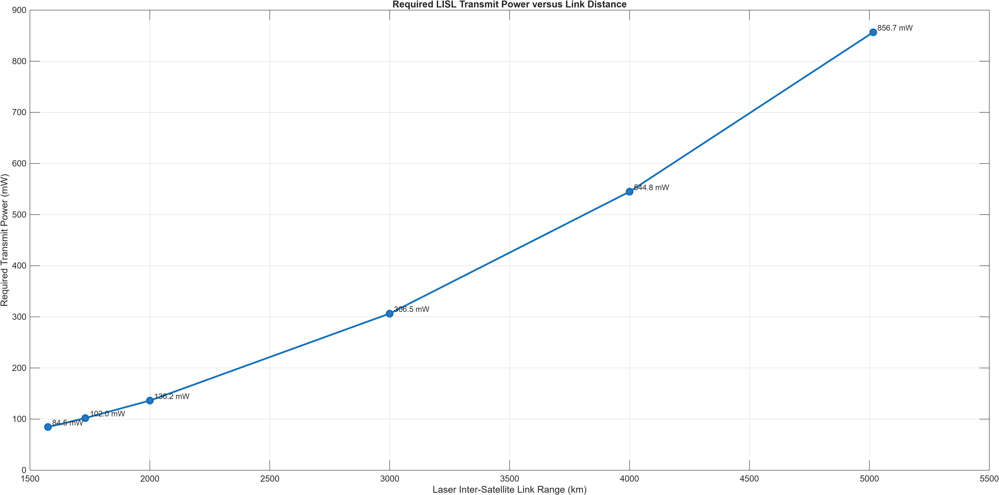
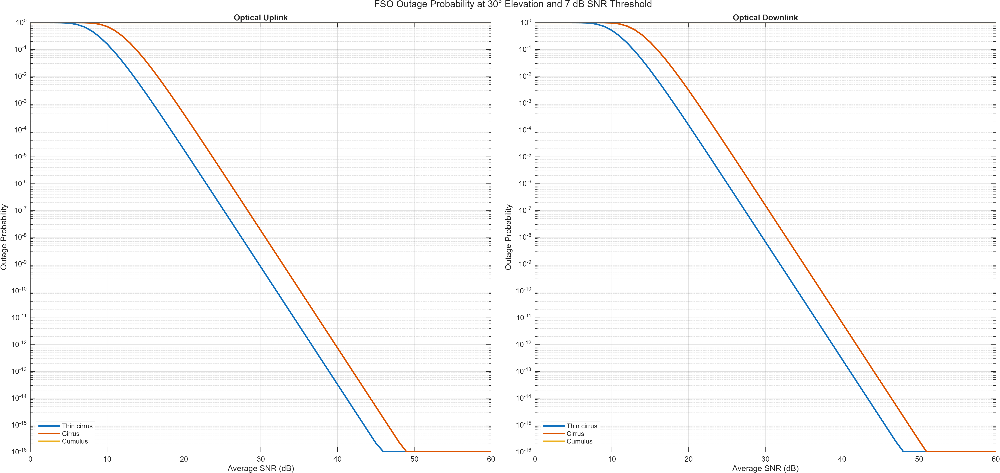

# FSO Satellite Network Analysis

A MATLAB implementation of selected link-level models from:

> J. Liang et al., “Free-Space Optical (FSO) Satellite Networks Performance Analysis: Transmission Power, Latency, and Outage Probability,” *IEEE Open Journal of Vehicular Technology*, vol. 5, pp. 244–261, 2024.  
> [https://doi.org/10.1109/OJVT.2023.3341409](https://doi.org/10.1109/OJVT.2023.3341409)

The project studies:

- required laser inter-satellite link transmission power versus distance;
- optical uplink and downlink outage probability versus average SNR.

## Results

### Required ISL Transmission Power

The required received power is calculated from the receiver sensitivity and link margin using Equation (24) in [1]. The required transmission power is then calculated using Equation (1):

$$
P_T =
\frac{P_R}
{G_T G_R L_T L_R L_{PS}\eta_T\eta_R}.
$$

The optical gains, pointing losses, and free-space path loss are implemented using Equations (2)–(6) in [1].

Where:

- G<sub>T</sub> and G<sub>R</sub> are the transmitter and receiver optical gains.
- L<sub>T</sub> and L<sub>R</sub> are the transmitter and receiver pointing-loss factors.
- L<sub>PS</sub> is the free-space path-loss factor.
- η<sub>T</sub> and η<sub>R</sub> are the transmitter and receiver optical efficiencies.
- P<sub>R</sub> is the required received power.



The numerical results are saved in [`results/power_vs_distance.csv`](results/power_vs_distance.csv).

### Outage Probability

An outage occurs when the instantaneous SNR falls below the required threshold, as defined in Equation (38) of [1]:

$$
P_{\mathrm{out}} = \Pr(\gamma \leq \gamma_{\mathrm{th}}).
$$

The simulation compares thin-cirrus, cirrus, and cumulus cloud conditions for optical uplink and downlink communication.



The calculated values at 30 dB are saved in [`results/outage_at_30dB.csv`](results/outage_at_30dB.csv).

## Implemented Models

The `models` folder contains:

- `freeSpaceLoss.m`, `opticalGain.m`, `pointingLoss.m`, and `linkBudgetISL.m`: ISL link budget using Equations (1)–(6), (23), and (24) in [1];
- `slantRange.m`: ground-to-satellite slant distance using Equation (8) in [1];
- `atmosphericLoss.m`: Mie and geometrical scattering using Equations (10)–(22) in [1];
- `Cn2.m` and `scintillationIndex.m`: atmospheric turbulence using Equations (30)–(32) in [1];
- `weibullParameters.m`: exponentiated-Weibull parameters α, β, and η using Equations (25)–(29) in [1];
- `outageProbability.m`: optical-link outage probability using Equations (38) and (39) in [1].

## Repository Structure

```text
FSO-Satellite-Network-Analysis/
├── main.m
├── parameters.m
├── models/
├── simulations/
│   ├── powerVsDistance.m
│   └── outageVsSNR.m
├── figures/
├── results/
├── README.md
├── LICENSE
└── .gitignore
```

## Requirements

- MATLAB R2020a or later
- No additional MATLAB toolboxes are required

The project was tested using MATLAB R2025b.

## Running the Project

1. Download or clone the repository.
2. Open the project folder in MATLAB.
3. Run:

```matlab
main
```

The program runs both simulations and saves:

```text
figures/power_vs_distance.png
figures/outage_vs_snr.png
results/power_vs_distance.csv
results/outage_at_30dB.csv
```

## Main Parameters

Unless identified as an assumption, the following parameters are taken from [1].

| Parameter | Value | Reference / basis |
|---|---:|---|
| Wavelength | 1550 nm | [1, Table 6] |
| Optical efficiencies | 0.8 | [1, Table 6] |
| Receiver telescope diameter | 80 mm | [1, Table 6] |
| Pointing errors | 1 μrad | [1, Table 6] |
| Full transmitter divergence angle | 15 μrad | [1, Section V-B] |
| Receiver sensitivity | -35.5 dBm | [1, Table 6] |
| ISL link margin | 3 dB | [1, Section V-B] |
| Ground-station altitude | 0.1 km | [1, Table 6] |
| Satellite altitude | 550 km | [1, Section IV-A1] |
| Troposphere height | 20 km | [1, Table 6] |
| Elevation angle | 30° | [1, Table 6] |
| SNR threshold | 7 dB | [1, Table 6] |
| RMS wind-speed parameter | 21 m/s | Hufnagel–Valley assumption based on [2] |
| Ground-level C<sub>n</sub><sup>2</sup>(0) | 1.7 × 10<sup>-14</sup> m<sup>-2/3</sup> | Hufnagel–Valley assumption based on [2] |

## Cloud Conditions

The cloud parameters are taken from [1, Table 6].

| Condition | Cloud concentration | Liquid water content |
|---|---:|---:|
| Thin cirrus | 0.5 cm<sup>-3</sup> | 3.128 × 10<sup>-4</sup> g/m<sup>3</sup> |
| Cirrus | 0.025 cm<sup>-3</sup> | 0.06405 g/m<sup>3</sup> |
| Cumulus | 250 cm<sup>-3</sup> | 1.0 g/m<sup>3</sup> |

## Assumptions and Limitations

The source paper does not provide numerical values for RMS wind speed or ground-level C<sub>n</sub><sup>2</sup>(0). This implementation uses the standard Hufnagel–Valley 5/7 values:

- RMS wind speed: 21 m/s
- C<sub>n</sub><sup>2</sup>(0): 1.7 × 10<sup>-14</sup> m<sup>-2/3</sup>

Consequently, the outage plots reproduce the qualitative behaviour reported in the paper but do not exactly reproduce its SNR operating points.

The source paper also contains an apparent divergence-angle inconsistency: its parameter table lists 1.5 μrad, while the methodology text states 15 μrad. This implementation uses 15 μrad.

The auxiliary Weibull normalization function g(α, β) is not explicitly defined in the source paper. It is calculated numerically by enforcing unit mean irradiance.

The following constellation-dependent components are outside the current scope:

- Walker constellation generation;
- satellite motion and link visibility;
- Dijkstra shortest-path routing;
- average satellite power along a complete route;
- end-to-end network latency;
- network-level power-latency trade-off.

## Validation

At a 30° elevation angle using the baseline turbulence assumptions, the model produces:

| Quantity | Approximate value |
|---|---:|
| Rytov variance | 0.19915 |
| Scintillation index | 0.21578 |
| Weibull α | 2.92504 |
| Weibull β | 2.99577 |
| Weibull η | 0.85728 |

The results also satisfy the expected qualitative checks:

- outage probability decreases as average SNR increases;
- thin cirrus performs better than cirrus;
- downlink outage is higher than uplink outage;
- cumulus conditions make the optical link effectively unavailable.

## Future Work

A potential extension is implementing a time-varying Walker satellite constellation. Satellite visibility and feasible laser links could then be used with Dijkstra’s algorithm to calculate shortest routes, end-to-end latency, and average satellite transmission power. This would enable reproduction of the paper’s network-level power-latency trade-off.


## References

1. J. Liang et al., “Free-Space Optical (FSO) Satellite Networks Performance Analysis: Transmission Power, Latency, and Outage Probability,” *IEEE Open Journal of Vehicular Technology*, vol. 5, pp. 244–261, 2024. [DOI](https://doi.org/10.1109/OJVT.2023.3341409)

2. “Free Space Ground to Satellite Optical Communications Using Kramers–Kronig Transceiver in the Presence of Atmospheric Turbulence,” *Sensors*, 2022. [Article](https://pmc.ncbi.nlm.nih.gov/articles/PMC9105684/)

3. ITU-R P.1621, “Propagation Data Required for the Design of Earth-Space Systems Operating Between 20 THz and 375 THz.”

## License

The MATLAB source code is available under the MIT License. See [`LICENSE`](LICENSE).

The referenced publications are not covered by the software license.

## Author

Developed by **Samarth Dewan**.

GitHub: [@samarthdewan](https://github.com/samarthdewan)
